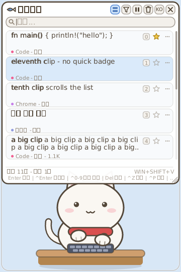

# 🐱 ClipCat — the desktop cat that eats your clipboard

*[한국어는 아래에 ↓](#-clipcat--클립보드를-먹는-데스크탑-고양이)*

A clipboard manager with a heartbeat. A small cat sits at the bottom of your
screen and types along with you (à la Bongo Cat) — and **every time you copy
something, anywhere, it eats a fish badged with the app you copied from** and
files the clip into its history. Click a clip to copy it back. Pin, search,
delete — all inside one tiny (~1 MB) native binary.

**Windows · macOS · Linux** — fully transparent click-through native build on
Windows; a portable build sharing the same core on macOS/Linux.



## Features

- **Clipboard history** — every text copy is captured system-wide and stored
  locally (up to 100 clips + pinned clips that never expire).
- **The fish** 🐟 — each copy sends a fish flying into the cat's mouth, tinted
  and badged with the source app (its real icon on Windows, an initial
  elsewhere). Copying feeds the cat: +5 XP per clip.
- **Panel** — `Win+Shift+V` on Windows (configurable; auto-falls back to
  `Ctrl+Shift+V` if taken), `Cmd+Shift+V` on macOS, `Super+Shift+V` on
  Linux — or middle-click / the tray / `C`. Type to search (Korean
  included), click to copy back, ★ to pin, ✕ to delete, 🗑 to clear,
  ⏸ to pause capture (privacy pause).
- **Filter by app** — the funnel button (or `Tab`) cycles through the apps
  you copied from; the active app shows as a chip in the search box and
  combines with the text search.
- **Arrange the panel your way** — drag its header to move it (the cat
  stays put), drag the bottom-right grip to resize it; both persist.
  **Ctrl+0–9** instantly copies one of the badged top ten rows, and
  "Close panel after copy" can be switched off to grab several clips.
- **English + Korean** — full UI in both, switchable at runtime. All text
  renders in your **system font** (Segoe UI / Malgun Gothic on Windows —
  read from the OS, never bundled).
- **Bongo-cat core loop** — global input *counts* drive paw taps, XP and
  levels: 2 XP/key, 1 XP/click & scroll, 5 XP/copy. Level-ups unlock
  accessories (scarf, glasses, beanie, headphones, crown, wizard hat).
- **Today's stats bubble** — hover the cat: keys, clicks, copies, active time.
- **Alive** — breathing, blinking, tail, sweat when you type fast, sleep
  after 75 s idle, hearts when petted.
- **Unobtrusive & light** — always-on-top without stealing focus, transparent
  pixels click through (Windows), single exe, no installer, ~12-16 MB RAM.

## Controls

| Gesture | Effect |
|---------|--------|
| Copy anywhere (Ctrl+C) | Cat eats a fish; clip saved to history |
| `Win+Shift+V` (`Cmd+Shift+V` on macOS) / middle-click | Toggle the clipboard panel |
| Click a clip row | Copy it back to the clipboard |
| `Ctrl+0`–`9` (panel open) | Quick-copy the row with that digit badge |
| Star / ✕ on a row | Pin / delete the clip |
| Funnel button / `Tab` (panel open) | Cycle the source-app filter |
| Type while panel is open | Search (arrows + Enter work too; Esc clears query → filter → closes) |
| Drag the panel header / corner grip | Move / resize the panel (cat stays put) |
| Drag | Move the pet (unless position-locked) |
| Click | Boop (squash bounce, +1 XP) |
| Double-click | Pet it (+10 XP, hearts) |
| Hover | Today's stats bubble |
| Right-click (Windows) | Menu: clipboard, capture pause, close-after-copy, size, accessory, sound, lock, language, autostart, reset |
| Tray icon click (Windows) | Hide/show the cat |

### Portable build (macOS / Linux) keyboard shortcuts

Global (works everywhere): `Cmd+Shift+V` (macOS) / `Super+Shift+V` (Linux)
toggles the clipboard panel. With the window focused (and the panel closed):
`C` clipboard panel · `O` close-after-copy · `S` size · `A` accessory ·
`M` sound · `B` stats bubble · `L` lock · `G` language · `Q`/`Esc` quit.

## Platform differences

| | Windows (native) | macOS / Linux (portable) |
|---|---|---|
| Window | fully transparent, click-through | opaque "card" (softbuffer has no per-pixel alpha) |
| Clipboard watch | `WM_CLIPBOARDUPDATE` listener | `arboard` polling (~0.4 s) |
| Fish badge | real app icon | colored initial |
| Panel hotkey | global `Win+Shift+V` (configurable, `Ctrl+Shift+V` fallback) | `C` / middle-click (window-local) |
| Settings UI | tray menu | keyboard shortcuts |
| Sound | winmm synth | (silent in v2) |
| Global input | `WH_*_LL` hooks | `rdev` (macOS needs Accessibility; X11 only on Linux) |

Design history lives in [`.context/kb/adr/`](.context/kb/adr/), the spec in
[`docs/specs/clipcat-spec.md`](docs/specs/clipcat-spec.md).

## Build

```bash
# default backend (Windows=native, macOS/Linux=portable)
cargo build --release          # binary: target/release/clipcat[.exe]

# test the portable backend on Windows
cargo build --release --features portable

# regenerate the icon / preview frames after art changes
cargo run --bin gen_icon
cargo run --release --example preview
```

Requires Rust (MSVC toolchain on Windows). Linux needs system libraries for
the portable stack — on Debian/Ubuntu: `apt-get install libx11-dev libxi-dev
libxtst-dev libxkbcommon-dev libxkbcommon-x11-dev pkg-config`. CI builds
Windows and macOS.

## Data & privacy

Everything stays on your machine — **there is no network code in the binary**.

- Input hooks count keystrokes/clicks only; **which** key is pressed is never
  read, stored or transmitted (`src/input.rs` atomic counters).
- Clipboard history is stored locally in `clips.json`; capture can be paused
  any time (⏸ in the panel / tray menu), clips > 256 KB are ignored, and
  stats/settings live in `state.json` next to it:
  Windows `%APPDATA%\ClipCat`, macOS `~/Library/Application Support/ClipCat`,
  Linux `$XDG_CONFIG_HOME/ClipCat`. A pre-2.0 `DeskCat` config dir is
  migrated automatically.

## Tech notes

- No GUI framework — [tiny-skia](https://github.com/linebender/tiny-skia)
  vector rendering + direct OS APIs per backend.
- One platform-agnostic core (`pet`, `clipboard`, `panel`, `render`, `state`,
  `i18n`) + two backends: native Win32 (layered window, tray, clipboard
  listener) and portable (`winit` + `softbuffer` + `rdev` + `arboard`).
- Icon and sounds are generated from code — no bundled assets, single
  binary. All text renders in the OS's own fonts (loaded at runtime via
  `ab_glyph`, ADR-0007/0011).
- User-facing changes are tracked in [CHANGELOG.md](CHANGELOG.md); releases
  are cut with `scripts/release.sh`.

---

# 🐱 ClipCat — 클립보드를 먹는 데스크탑 고양이

살아있는 클립보드 매니저. 화면 아래에 앉은 고양이가 봉고캣처럼 타이핑을 따라
치고 — **어디서든 복사(Ctrl+C)할 때마다 복사한 앱의 뱃지가 붙은 생선을 냠**
하고 먹으며 클립을 히스토리에 저장합니다. 클립을 클릭하면 다시 복사되고,
고정·검색·삭제까지 — 전부 ~1MB짜리 네이티브 바이너리 하나로.

## 특징

- **클립보드 히스토리** — 시스템 전역의 텍스트 복사를 감지해 로컬에 저장
  (히스토리 100개 + 만료되지 않는 고정 클립).
- **생선** 🐟 — 복사할 때마다 출처 앱의 아이콘(Windows) 또는 이니셜 뱃지가
  붙은 생선이 고양이 입으로 날아갑니다. 복사 1회 = +5 XP.
- **패널** — `Win+Shift+V`(Windows 기본, 변경 가능 — 다른 앱이 선점하면
  `Ctrl+Shift+V`로 자동 대체), 휠클릭, 트레이 메뉴 또는 `C` 키로 열기:
  타이핑으로 검색(한글 지원), 클릭으로 재복사, ★ 고정, ✕ 삭제, 🗑 비우기,
  ⏸ 수집 일시정지(프라이버시 모드).
- **출처 앱 필터** — 깔때기 버튼(또는 `Tab`)으로 복사해 온 앱별로 클립을
  걸러 봅니다. 활성 필터는 검색창의 칩으로 표시되고 텍스트 검색과 함께
  적용됩니다.
- **패널을 내 마음대로** — 헤더를 드래그해 패널만 이동(고양이는 제자리),
  오른쪽 아래 그립을 드래그해 크기 조절 — 둘 다 기억됩니다. **Ctrl+0~9**로
  뱃지가 붙은 상위 10개 클립을 즉시 복사하고, "복사 후 패널 자동 닫기"를
  꺼서 여러 클립을 연달아 가져올 수도 있습니다.
- **영어 + 한국어** — 런타임에 전환 가능한 완전한 양국어 UI. 통계 말풍선을
  포함한 모든 텍스트가 **시스템 폰트**(Windows: 맑은 고딕/Segoe UI — OS에서
  읽어 오며 번들하지 않음)로 렌더링됩니다.
- **봉고캣 코어 루프** — 키 1회 = 2 XP, 클릭/스크롤 = 1 XP, 복사 = 5 XP.
  레벨업하면 액세서리가 잠금해제됩니다 (목도리·안경·비니·헤드폰·왕관·마법사 모자).
- **오늘의 통계** — 마우스를 올리면 키 입력 / 클릭 / 복사 / 활동 시간 표시.
- **살아있는 애니메이션** — 호흡, 깜박임, 꼬리, 빠른 타이핑 시 땀방울, 75초
  방치 시 잠들기, 더블클릭 쓰다듬기.
- **가벼움** — 포커스를 훔치지 않는 항상 위 창, 투명 부분 클릭 통과(Windows),
  단일 exe, 설치 불필요, 메모리 ~12-16MB.

## 조작법

| 동작 | 효과 |
|------|------|
| 어디서든 복사 (Ctrl+C) | 고양이가 생선을 먹고 클립 저장 |
| `Win+Shift+V` (Windows) / 휠클릭 | 클립보드 패널 열기/닫기 |
| 클립 행 클릭 | 클립보드로 재복사 |
| `Ctrl+0`~`9` (패널 열림) | 해당 숫자 뱃지 행을 바로 복사 |
| 행의 별 / ✕ | 고정 / 삭제 |
| 깔때기 버튼 / `Tab` (패널 열림) | 출처 앱 필터 순환 |
| 패널 열고 타이핑 | 검색 (방향키 + Enter, Esc는 검색어 → 필터 → 닫기 순서로 해제) |
| 패널 헤더 / 모서리 그립 드래그 | 패널만 이동 / 크기 조절 (고양이는 제자리) |
| 드래그 | 위치 이동 (잠금 시 제외) |
| 클릭 | 콩— (+1 XP) |
| 더블클릭 | 쓰다듬기 (+10 XP, 하트) |
| 마우스 올리기 | 오늘의 통계 말풍선 |
| 우클릭 (Windows) | 메뉴: 클립보드 · 수집 일시정지 · 복사 후 자동 닫기 · 크기 · 액세서리 · 소리 · 위치 잠금 · 언어 · 자동 실행 · 초기화 |
| 트레이 아이콘 클릭 (Windows) | 고양이 숨기기/보이기 |

### portable 빌드 (macOS / Linux) 단축키

창에 포커스를 준 뒤 (패널이 닫힌 상태에서):
`C` 클립보드 패널 · `O` 복사 후 자동 닫기 · `S` 크기 · `A` 액세서리 ·
`M` 소리 · `B` 통계 고정 · `L` 위치 잠금 · `G` 언어 · `Q`/`Esc` 종료

## 데이터 & 프라이버시

모든 데이터는 이 PC에만 저장됩니다 — **바이너리에 네트워크 코드가 없습니다**.

- 입력 훅은 횟수만 셉니다. 어떤 키인지는 절대 읽지/저장하지/전송하지
  않습니다 (`src/input.rs`의 원자 카운터).
- 클립 히스토리는 로컬 `clips.json`에 저장되며 언제든 수집을 일시정지할 수
  있습니다 (패널 ⏸ / 트레이 메뉴). 256KB 초과 텍스트는 무시됩니다.
  저장 위치: Windows `%APPDATA%\ClipCat`, macOS
  `~/Library/Application Support/ClipCat`, Linux `$XDG_CONFIG_HOME/ClipCat`.
  기존 DeskCat(1.x) 설정은 자동 마이그레이션됩니다.

## 빌드

```bash
cargo build --release                       # 실행 파일: target/release/clipcat[.exe]
cargo build --release --features portable   # Windows에서 portable 백엔드 테스트
cargo run --bin gen_icon                    # 아트 변경 후 아이콘 재생성
cargo run --release --example preview       # 렌더링 프리뷰 PNG 생성
```

요구 사항: Rust (Windows는 MSVC). Linux는 portable 스택용 시스템 라이브러리가
필요합니다 — Debian/Ubuntu: `apt-get install libx11-dev libxi-dev libxtst-dev
libxkbcommon-dev libxkbcommon-x11-dev pkg-config`.
