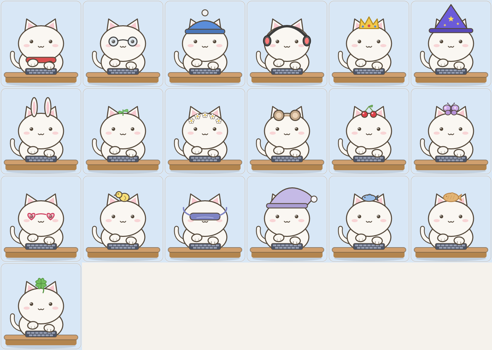

# 방향 1 — 악세사리 확장

> ClipCat 고양이 캐릭터 업그레이드 7개 방향 중 #1. 본캐("생선 본위제 먹보 고양이의
> 속마음 + id-미러", 부록 B 참조)를 척추로 공유한다. 산출물: 기획/구현 아이디어 문서.

## What (정의)

방향 1은 ClipCat 고양이가 **몸에 걸치는 코스메틱 자산과 착용 시스템 자체**를 확장하는 작업이다. 현재는 `src/render.rs:36`의 `Accessory` enum(6종: 목도리·안경·비니·헤드폰·왕관·마법사모자)과 `Persist.accessory: usize`(`src/state.rs:20`) 단일 슬롯으로, 머리 영역 한 곳에만 하나를 착용한다. 이 방향은 (a) **멀티 슬롯**(머리/얼굴/목/앞발)으로 착용 면적을 넓히고, (b) **신규 코드드로잉 악세사리 8~12종**을 추가하며, (c) `draw_accessory`에 **컬러 파라미터**를 도입하고, (d) **앞발 소품**과 (e) **로컬 날짜 기반 시즌 룩**을 더한다.

생선 본위제(생선으로 세상을 환산하는 먹보 고양이)와의 직결 고리는 **생선 모자(Fish Hat) = 셀프 패러디**다. "세상 모든 걸 생선으로 바꾸는" 고양이가 급기야 자기 머리에 생선을 얹는, 정체성의 시각적 펀치라인이다. 앞발 소품의 **미니 생선**(생선 본위제의 화폐 단위를 손에 쥔 모습), **하트 팻말**(id-미러 보이스 "나 대신 빡쳐줄게"의 소품화)도 동일한 정체성 스파인 위에 놓인다. 수집 UI/세트/완성 보너스는 방향4 담당이므로 여기서는 **아이템 에셋과 착용 메커니즘**에만 집중한다.

## Why (기대효과)

- **꾸미기 = 리텐션 동력.** 보상 루프(`src/pet.rs:1419` `level_up`)가 이미 "레벨업 → 자동 착용 + 토스트 + 스파클 8개"로 동작한다. 착용 가능한 아이템 수를 6 → 16~20종으로 늘리면 동일 루프에서 "다음에 뭐가 풀릴까"의 기대 곡선이 길어진다. AGENTS.md 골든룰(보상은 기존 positive loop만)을 깨지 않고 리텐션을 늘리는 가장 안전한 레버다.
- **자기표현 = 매력(볼매)의 표면.** 고정 본캐는 그대로 두고(정체성 불변), 외형만 사용자가 고른다. 멀티 슬롯 + 컬러는 "내 고양이"라는 소유감을 만든다. 같은 본캐라도 조합이 달라 스크린샷 공유 동기가 생긴다.
- **셀프 패러디 = 짤 친화성.** 생선 모자 한 컷은 그 자체로 "1프레임 = 완결된 짤"의 시각 버전이다. 카카오톡 이모티콘 성공 공식(한 컷에 정체성+유머)과 정확히 맞물린다.
- **저비용 고확장.** 신규 악세사리 1종 난이도는 EASY(render/state/i18n/preview 약 5곳). 에셋이 전부 코드드로잉이라 번들 이미지·디자이너 의존 없이 PR 단위로 무한 증분 가능하다.

## 구현 아이디어 (구체화)

### 1. 멀티 슬롯화 (머리/얼굴/목/앞발) — 하위호환 유지
- **무엇을:** 단일 슬롯을 4슬롯(hat/face/neck/paw)으로. 단 `Persist.accessory: usize`는 **삭제하지 않고 레거시 hat 슬롯으로 유지**해 기존 state.json을 무손실 로드.
- **어떻게:** `src/state.rs:13` `Persist`에 `#[serde(default)]`가 이미 걸려 있으므로(`src/state.rs:12`), 신규 필드 `face: usize`, `neck: usize`, `paw_acc: usize`를 추가하면 구버전 JSON은 자동으로 0(none)으로 디시리얼라이즈된다. `Default for Persist`(`src/state.rs:69`)에도 0 추가. `src/render.rs:172` `Scene`에 `Accessory` 4개 필드로 확장하거나 enum을 슬롯별로 분리. `src/render.rs:411`의 단일 `draw_accessory` 호출을 슬롯별 호출(face는 `draw_face` 직후, neck은 목 영역, paw는 `draw_paw` 호출 라인 `src/render.rs:439-440` 근처)로 나눈다. 메뉴(`src/pet.rs:1261` `build_menu`)는 슬롯별 서브메뉴로, `apply_menu_action`의 `SetAccessory`(`src/pet.rs:1355`)를 `SetSlot(slot, id)` 형태로 일반화하되 레벨 가드 로직은 그대로 재사용.
- **난이도:** MEDIUM (슬롯 분리 + 메뉴/액션 일반화 + 하위호환 테스트).
- **생선본위제 연결:** 슬롯이 늘어야 "생선 모자 + 미니 생선 앞발"을 **동시에** 착용해 셀프 패러디를 최대치로 끌어올릴 수 있다.

### 2. 신규 코드드로잉 악세사리 8~12종
- **무엇을:** 리본/보우, 꽃, 토끼귀, 베레모, 후드, 담요 망토(무해/위로), 안대(수면), **생선 모자(셀프 패러디)** 등.
- **어떻게:** `src/render.rs:36` `Accessory`에 variant 추가 → `from_id`(`src/render.rs:46`)에 id 매핑 → `draw_accessory`의 match(`src/render.rs:647`)에 그리기 분기 추가. 그리기는 기존 패턴 그대로 재사용: `oval`(`src/render.rs:211`), `round_rect`(`src/render.rs:217`), `PathBuilder` + `cv.fill_t/stroke_t`(`src/render.rs:243/252`), 별은 `star_at`(`src/render.rs:748`), 하트는 `heart_path`(`src/render.rs:752`). 좌표계는 기존 악세사리와 동일한 머리 캔버스(머리 중심 ≈ (120,128), 비니 정점 y≈30 참고 `src/render.rs:671`)를 그대로 쓴다. 생선 모자는 `src/render.rs:563` 이하 fish 드로잉 헬퍼(`lighten`/`darken`)를 참고해 머리 위 작은 생선으로. 테이블 등록은 `src/state.rs:320` `ACCESSORIES`에 `AccessoryDef{level, name_kr, name_en}` 행 추가(레벨 게이팅 자동 적용).
- **난이도:** 각 EASY (render match + state 테이블 + preview 1컷).
- **생선본위제 연결:** 생선 모자는 정체성의 시각적 펀치라인. 담요 망토/안대는 late-night→다정, idle 무드의 시각적 앵커로 보이스 엔진과도 공명.

### 3. 컬러 변형 / 스킨 (draw_accessory에 색 파라미터)
- **무엇을:** 같은 모양을 색만 바꿔 변형(예: 빨간 목도리 → 분홍/민트/라벤더). 2030 여성 타깃 팔레트.
- **어떻게:** `draw_accessory`(`src/render.rs:647`)에 색 인자(`tint: Option<(u8,u8,u8)>` 또는 팔레트 인덱스)를 추가하고, 현재 하드코딩된 `(217,79,79,255)` 같은 리터럴을 인자 기반으로 치환. 색 파생은 기존 `lighten`/`darken`(`src/render.rs:565/570`)을 재사용해 본색에서 외곽선/그림자색을 자동 생성 → 팔레트 항목당 색 하나만 정의하면 됨. `Persist`에 `accessory_tint: usize`(팔레트 인덱스) 신규 필드(serde default 0 = 원색). 메뉴는 슬롯 서브메뉴 아래 색 서브메뉴로.
- **난이도:** MEDIUM (시그니처 변경 + 색 파라미터 전파 + 하위호환 필드).
- **생선본위제 연결:** 직접 연결은 약하나, 동일 본캐의 외형 다양성으로 소유감/공유 동기를 강화(매력 동인).

### 4. 앞발(paw) 소품
- **무엇을:** 미니 생선 / 커피 / 하트 팻말을 앞발에 쥐여줌.
- **어떻게:** `draw_paw`(`src/render.rs:546`)는 현재 앞발 위치 `y = lerp(184,198, press)`와 회전을 계산한다. 동일 좌표 기준으로 앞발 소품을 그리는 작은 헬퍼를 추가하거나, `draw_paw` 호출부(`src/render.rs:439-440`) 직후 paw 슬롯 소품을 그린다. 미니 생선은 fish 드로잉 재사용, 하트 팻말은 `heart_path`(`src/render.rs:752`) + `round_rect` 막대. press 애니메이션(`Scene.paw_l/paw_r`)과 함께 위아래로 움직이게 하려면 동일 `press`/`breath_dy` 값을 넘긴다.
- **난이도:** EASY~MEDIUM (paw 좌표 재사용은 쉬우나, 타이핑 애니메이션과의 겹침 처리 검토 필요).
- **생선본위제 연결:** 미니 생선 = 생선 본위제의 "화폐 단위"를 손에 쥔 모습. 하트 팻말 = id-미러 보이스("나 대신 빡쳐줄게")의 소품화.

### 5. 시즌 한정 룩 (로컬 날짜 기반)
- **무엇을:** 특정 월/일에만 메뉴에 노출되는 한정 외형(예: 12월 산타 모자, 봄 벚꽃, 핼러윈).
- **어떻게:** `state::today_string()`(`src/state.rs:258` Win32 / `:266` unix)가 이미 `"YYYY-MM-DD"` 로컬 날짜를 반환한다(프라이버시·네트워크 무관, 순수 로컬). `build_menu`(`src/pet.rs:1261`)에서 월(`&today[5..7]`)을 보고 해당 시즌 악세사리만 메뉴 항목에 포함. 그리기는 아이디어 2와 동일 패턴. **주의:** 보상 루프는 "earn XP → unlock"만 허용되므로(골든룰 1), 시즌 룩은 **레벨 도달 + 시즌 윈도우 내 노출**까지만. "오늘 안 들어오면 못 받음" 같은 neglect-guilt/streak 메커니즘은 **금지** — 단지 그 시즌 동안 메뉴에 보일 뿐 풀린 아이템은 영구 착용 가능하게 한다.
- **난이도:** EASY~MEDIUM (날짜 게이팅 분기 + 시즌 윈도우 정의).
- **생선본위제 연결:** "생선 산타 모자"처럼 시즌 + 셀프패러디를 합치면 짤 친화성 극대화.

### 6. 프리뷰 & i18n 정비
- **무엇을:** 신규 에셋을 헤드리스로 눈으로 검증하고, 모든 사용자 노출 문자열을 EN/KO 양쪽 확보.
- **어떻게:** `examples/preview.rs`의 `base_scene`(`examples/preview.rs:13`)에 신규 슬롯 필드를 채우고, 신규 악세사리/색/시즌 조합을 그리는 컷을 `main`에 추가(아이콘 컷 `examples/preview.rs:287` 패턴 그대로 `Pixmap::new` → `render_card` → `save`). i18n는 악세사리 이름이 `ACCESSORIES` 테이블의 `name_kr/name_en`(`src/state.rs:321`)으로 들어가므로 별도 i18n 함수가 거의 불필요하나, 새 메뉴 라벨(슬롯명/색명)은 `src/i18n.rs`의 `Msg` enum + `t()`에 EN/KO 추가. 기존 `new_accessory`/`accessory_locked`(`src/i18n.rs:279/286`)는 그대로 재사용.
- **난이도:** EASY.
- **생선본위제 연결:** 간접(품질 게이트).

## 여성 타깃 근거

주 타깃은 **2030 한국 여성**(카카오톡 이모티콘 구매자의 75%+)이다.

- **꾸미기·자기표현 동인:** 이모티콘/캐릭터 소비층의 핵심 행동은 "내 캐릭터를 내 취향으로 만든다"이다. 멀티 슬롯 + 컬러 변형(아이디어 1·3)은 동일 본캐에서 조합 다양성을 제공해 소유감을 만든다.
- **팔레트:** 컬러 변형 기본값을 분홍/민트/라벤더/크림 등 부드러운 톤으로 두면 타깃 미감과 정렬된다(`lighten`/`darken`로 본색에서 자동 파생하므로 톤 일관성 유지 쉬움).
- **공유성:** 토끼귀·리본·꽃·담요 망토 등은 "귀여움 → 스크린샷 공유"의 전형적 트리거. 생선 모자 셀프패러디는 유머 코드까지 더해 짤 공유 동기를 강화.
- **위로/다정 텍스처:** 담요 망토(위로)·안대(수면) 같은 아이템은 보이스 엔진의 late-night→다정, id-미러 register("오늘은 그냥 눕자, 생선은 내일")와 시각적으로 공명해 "그건 완전 나" 투사를 강화.
- **압박 없는 보상:** streak/guilt 없이 "놀다 보니 풀림" 구조라 부담 없는 일상 동반자 포지션을 유지(타깃이 선호하는 무해함).

## 검증 & 리스크

**빌드·검증 절차**
- `cargo build` — 컴파일 통과.
- `cargo clippy --all-targets -- -D warnings` — 경고 무관용(AGENTS.md 컨벤션).
- `cargo test` — `src/state.rs:329` 테스트 모듈에 이미 `every_accessory_has_a_reachable_level`(`src/state.rs:356`)과 `levels_advance_monotonically`가 있어 신규 `ACCESSORIES` 행이 레벨 범위(2~99)·비어있지 않은 이름을 자동 검증. `src/pet.rs:1654` 인근 메뉴 잠금 테스트(`SetAccessory` 잠금/가드)도 슬롯 일반화 후 갱신·유지.
- `cargo run --release --example preview` — 신규 악세사리/슬롯/색/시즌 컷을 PNG로 출력해 눈으로 확인(헤드리스 가능).
- **백엔드 패리티:** 착용 상태는 코어 `render.rs`/`state.rs`/`pet.rs`에만 살고 OS 코드(`src/platform/`)를 건드리지 않으므로 네이티브 Win32 + winit/softbuffer 양 백엔드가 자동으로 동일 외형. 메뉴 항목이 늘면 양 백엔드 트레이 메뉴 렌더 폭만 점검.

**하위호환 (state.json 디시리얼라이즈)**
- `Persist`에 `#[serde(default)]`(`src/state.rs:12`)가 걸려 있어 신규 필드(`face/neck/paw_acc/accessory_tint`)는 구버전 JSON에서 자동으로 `Default` 값(0 = none/원색)으로 채워진다. 기존 `accessory` 필드는 그대로 두어 레거시 hat 착용 상태 보존. `Default for Persist`(`src/state.rs:69`)에 신규 필드 기본값 명시 필수. 마이그레이션 코드 불필요.

**성능**
- 코드드로잉이므로 슬롯/아이템이 늘면 프레임당 path fill/stroke 호출이 선형 증가하나, 한 프레임에 동시 착용은 최대 4슬롯이라 무시 가능. 메뉴는 항목 수만 증가(드로잉 부담 없음). 번들 이미지 0 → 바이너리 크기 영향 없음(골든룰 2 준수).

**프라이버시 (골든룰 1)**
- 모든 신규 기능은 **로컬 상태**(레벨·착용 인덱스·로컬 날짜)만 사용. 입력 후크는 손대지 않으며 KEYS/CLICKS/WHEEL 카운터 외 어떤 것도 읽지 않는다. 네트워크 사용 0(`update.rs`만 유일 허용 — 이 방향은 무관).
- **시즌 룩 함정 회피:** neglect-guilt/streak/한정 FOMO 메커니즘 **금지**. 시즌은 "그 기간 메뉴 노출"까지만이고 풀린 아이템은 영구 착용. `today_string`은 로컬 날짜만 반환하고 저장/전송하지 않음.

**기타 리스크**
- 새 의존성 0(전부 tiny-skia + serde 기존 스택) → ADR 불필요(골든룰 4).
- paw 소품(아이디어 4)은 타이핑 press 애니메이션과 겹칠 수 있어 z-순서/오프셋 조정 필요 — preview로 조기 검증.
- 슬롯 일반화 시 `MenuAction::SetAccessory(id)` 시그니처 변경이 양 백엔드 메뉴 디스패치에 파급 → 변경 범위를 `apply_menu_action`(`src/pet.rs:1342`) 단일 지점으로 모으고 기존 레벨 가드(`src/pet.rs:1356-1359`) 패턴 그대로 재사용해 회귀 최소화.

## 핵심 수정 파일
- `src/render.rs` (Accessory enum `:36`, from_id `:46`, draw_accessory match `:647`, draw_paw `:546`, Scene `:172`, 드로잉 헬퍼 oval/round_rect/fill_t/stroke_t)
- `src/state.rs` (Persist `:13` + serde default `:12`, Default `:69`, ACCESSORIES 테이블 `:320`, today_string `:258/266`, 테스트 `:329`)
- `src/pet.rs` (build_menu 악세사리 서브메뉴 `:1261`, apply_menu_action/SetAccessory `:1355`, level_up 자동착용 `:1419`)
- `src/i18n.rs` (Msg 메뉴 라벨, new_accessory `:279`, accessory_locked `:286`)
- `examples/preview.rs` (base_scene `:13`, 신규 컷 추가용 main)

## 렌더 미리보기 (현재 구현)

신규 악세사리는 `cargo run --release --example preview`로 헤드리스 렌더해 눈으로
검증한다. 아래는 현재까지의 디자인 기록이다.

*위 그리드 = 실제 출고 라인업. `Accessory::from_id`로 id 1~19를 렌더(좌→우,
위→아래가 해금 순서: Lv 18 토끼귀 … Lv 54 네잎클로버).*

탐색 과정의 후보 시트(폐기안 포함):
- [1차 배치](assets/accessories/explore-batch-1.png) — 리본·토끼귀·꽃·베레모·후드·담요망토(폐기)·안대·생선모자
- [후보 A](assets/accessories/explore-candidates-a.png) — 수면모자·데이지화관·별핀·새싹·곰귀·후광
- [후보 B](assets/accessories/explore-candidates-b.png) — 붕어빵·딸기·푸딩·하트선글라스·별달·병아리
- [큐트 3종](assets/accessories/explore-cute-trio.png) — 나비·체리·구름
- [네잎클로버](assets/accessories/clover.png) — 행운의 최상위 해금 (Lv 54)
